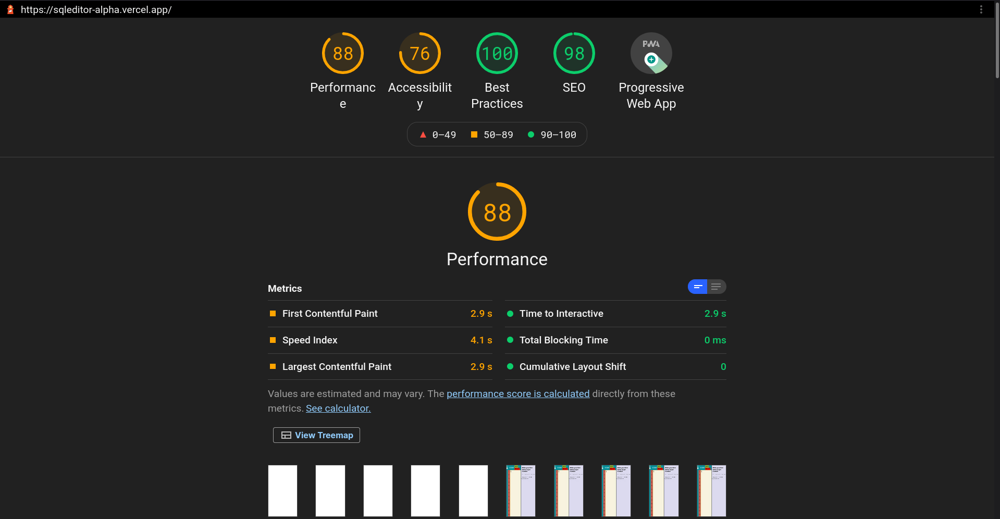

# Sql Editor

Sql commands on the go. What is this? Just an assignment from Atlan. Thoughts while making this? Design inspirations from Microsoft Teams, should be simple but should expose the whole power of SQL. Best way a text editor like interface for writing SQL queries. Text editor should be user friendly and have features like auto formatting (SQL keyword capitalization, etc), query check, and other features. History section for queries already executed and settings to control SQL database connection, profile, app theme, etc.

 

## Deployed

App link - https://sqleditor-alpha.vercel.app/

 

## Features
Some features are in `alpha` and others will be added in future
- [x] Text editor for sql query creation
- [x] SQL query auto formatting, query check, and intuitive errors
- [x] SQL query command history page: run, copy and delete cmd history
- [x] SQL query Table data visualization
- [ ] [Future Plan] Settings page for multi-theme, sql database connection, profile credentials, etc.

 

## Page Load Time
Calculated load time using a `loading started` in header inside the public index.html file and `loading ended` when react's useEffect gets called after first render. Also used `Lighthouse` and Reacts in build report web vitals functionality for performance reports. For improving performance multiple things where adopted including Code Splitting using React.lazy for screens and components not initially visible, structural changes, use of CDNs for icons, etc.

 

## Development
Make sure you have `Nodejs` installed
- `git clone https://github.com/sarthakpranesh/sqleditor.git`
- `cd sqleditor`
- `yarn install`
- `yarn start`

 
